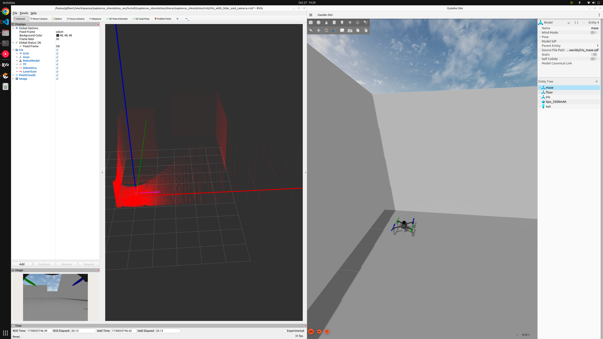
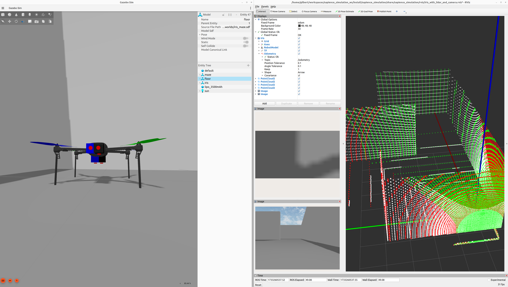
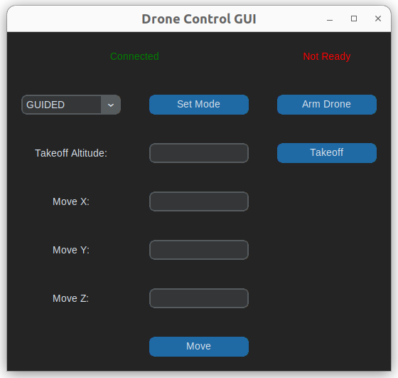

# Ardupilot Multiagent Simulation

Simulation environment for multiagent drone systems using Ardupilot, ROS 2, and Gazebo enabling users to spawn and control multiple drones, configure sensors, and test autonomous behaviors in a reproducible and extensible setup.

Maintainer: [Gilbert Tanner](mailto:gilbert.tanner@aau.at)

## Table of Contents

- [Prerequisites](#prerequisites)
- [Install Ardupilot environment](#install-ardupilot-environment)
- [Build workspace](#build-workspace)
- [Devcontainer](#devcontainer)
    - [Starting a Devcontainer](#starting-a-devcontainer)
        - [From VSCode](#from-vscode)
        - [From the Command Line](#from-the-command-line)
    - [Running just the Dockerfile](#running-just-the-dockerfile)
- [Run simulation](#run-simulation)
- [Multiagent simulation](#multiagent-simulation)
- [Drone configuration](#drone-configuration)
- [Fly the drone via position control](#fly-the-drone-via-position-control)
- [Feeding in external odometry](#feeding-in-external-odometry)
- [Limitations](#limitations)
    - [Not possible to do multiagent simulation with external odometry](#not-possible-to-do-multiagent-simulation-with-external-odometry)
    - [ap/geopose/filtered doesn't reflect global position set in Gazebo world](#apgeoposefiltered-doesnt-reflect-global-position-set-in-gazebo-world)
- [Troubleshooting](#troubleshooting)
    - [Drone model not spawning](#drone-model-not-spawning)
- [Contact](#contact)

## Prerequisites

- ROS Dev tools: `sudo apt install ros-dev-tools`

## Install Ardupilot environment

- [Install ROS 2](https://ardupilot.org/dev/docs/ros2.html)
- [ROS 2 with SITL](https://ardupilot.org/dev/docs/ros2-sitl.html)
- [ROS 2 with SITL in Gazebo](https://ardupilot.org/dev/docs/ros2-gazebo.html)

## Build workspace

```
source <path-to-ardupilot-workspace>
rosdep install --from-paths src --ignore-src -r -y
colcon build --symlink-install
```

## Devcontainer

Using a devcontainer or Dockerfile provides a consistent development environment, isolates dependencies, and avoids conflicts with other software on the host machine. This setup ensures that the project runs the same way on any device, improving reproducibility and easing collaboration.

### Starting a Devcontainer

#### From VSCode

1. Open the project in VSCode.
2. Press `F1` and select `Remote-Containers: Open Folder in Container...`.
3. Choose the folder to open in the container.

#### From the Command Line

1. Navigate to the project directory.
2. Run the following command:
    ```bash
    code . --folder-uri vscode-remote://dev-container+<container-id>
    ```

### Running just the Dockerfile

1. Build the Docker image:
    ```bash
    docker build -t multiagent_simulation .devcontainer
    ```
2. Run the Docker container:
    ```bash
    docker run -it --rm -v $(pwd):/workspace multiagent_simulation
    ```

## Run simulation

1. Source workspace
    ```
    source ./install/setup.{bash|zsh}
    ```
2. Launch the simulation
    ```
    ros2 launch multiagent_simulation multiagent_simulation.launch.py
    ```
    Launch the simulation with a specific world file
    ```bash
    ros2 launch multiagent_simulation multiagent_simulation.launch.py world_file:=rubico.sdf
    ```
    


The [multiagent_simulation.launch.py](src/multiagent_simulation/launch/multiagent_simulation.launch.py) allows the user to spawn multiple drones in the same world. Each drone gets its own ROS namespace and MAVLink system ID.


## Drone configuration

The LiDAR(s) and camera(s) are defined in separate xacro files ([lidar](src/multiagent_simulation/models/lidar/model.xacro), [camera](src/multiagent_simulation/models/camera/model.xacro)), [depth_camera](src/multiagent_simulation/models/depth_camera/model.xacro) and [rgbd_camera](src/multiagent_simulation/models/rgbd_camera/model.xacro) as macros allowing for quick addition and removal of sensors for testing.

Example:

```xml
<xacro:lidar_sensor name="lidar_3" pose="0.0 0.02 -0.05 0 1.57 0" horizontal_fov="0.614356" vertical_fov="0.673697" horizontal_samples="100" vertical_samples="50" update_rate="20" />
```

The xacro is then converted to SDF inside the [multiagent_simulation.launch.py](src/multiagent_simulation/launch/multiagent_simulation.launch.py).



## Fly the drone via position control

The move_drone node allows the user to set the flight mode, arm the drone, takeoff and move using position control.

> Note: After starting the simulation it might take a few seconds until the drone can be armed. If arming was successful "Not ready" should change to "Ready to Fly".

```
ros2 run multiagent_simulation move_drone
```



## Feeding in external odometry

The drone can be configured to fuse external odometry by changing the parameters described in [Cartographer SLAM with ROS 2 in SITL](https://ardupilot.org/dev/docs/ros2-cartographer-slam.html#configure-ardupilot). These parameters are already available in [gazebo-iris.parm](src/multiagent_simulation/config/gazebo-iris.parm) so in order to change from GPS navigation to external odometry navigation they only need to be uncommented and the GPS section commented out.

Ardupilot then receives the external odometry via the [`/ap/tf` topic](https://ardupilot.org/dev/docs/ros2-interfaces.html#odometry). Currently feeding external odometry in simulations is only supported for a single drone as described in the [limitations section below](#not-possible-to-do-multiagent-simulation-with-external-odometry).

## Limitations

### Not possible to do multiagent simulation with external odometry

**Description:** Currently, the `/ap` namespace isn't correctly namespace for multiple drones. For more details on this limitation, see [this issue](https://github.com/ArduPilot/ardupilot_gazebo/issues/140).

### ap/geopose/filtered doesn't reflect global position set in Gazebo world

**Related issue:** https://github.com/ArduPilot/ardupilot_gz/issues/74

## Troubleshooting

### Drone model not spawning

If the drone model isn't spawning into the simulation the `GZ_SIM_RESOURCE_PATH` environment variable might not be set correctly. This variable should include the [`models` folder](src/multiagent_simulation/models) and [`worlds` folder](src/multiagent_simulation/worlds) of the `multiagent_simulation` package and the [`src` folder](src) of the workspace. You can set it manually by running the following command:
```bash
WORKSPACE=${PWD}
export "GZ_SIM_RESOURCE_PATH=$GZ_SIM_RESOURCE_PATH:$WORKSPACE/src/multiagent_simulation/models:$WORKSPACE/src/multiagent_simulation/worlds:$WORKSPACE/src" >> ~/.bashrc
```

More information about this is available in the [Using SITL with Gazebo article](https://ardupilot.org/dev/docs/sitl-with-gazebo.html#configure-the-gazebo-environment).

## Contact

For any inquiries, please reach out to gilberttanner.contact@gmail.com or open an issue on this repository.